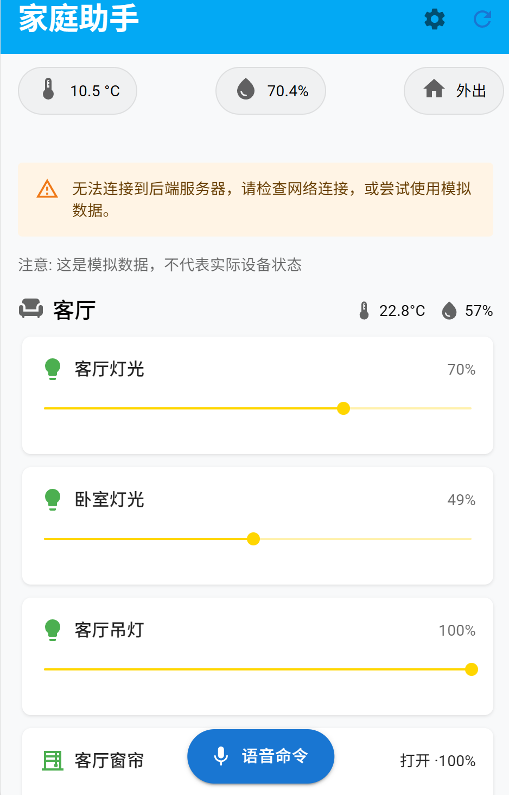

# CHANGELOG
---
## 5.12
* 实现了基本的前后端连接、语音输入


```
Prefix dict has been built successfully.
 * Serving Flask app 'app' (lazy loading)
 * Environment: production
   WARNING: This is a development server. Do not use it in a tion deployment.
   Use a production WSGI server instead.
 * Debug mode: on
 * Restarting with stat
Building prefix dict from the default dictionary ...
2025-05-12 17:15:27,627 - jieba - DEBUG - Building prefix dic the default dictionary ...
Loading model from cache 
Loading model cost 0.467 seconds.
2025-05-12 17:15:28,094 - jieba - DEBUG - Loading model cost 
seconds.
Prefix dict has been built successfully.
2025-05-12 17:15:28,094 - jieba - DEBUG - Prefix dict has beet successfully.
2025-05-12 17:15:28,370 - werkzeug - WARNING -  * Debugger ise!
2025-05-12 17:15:28,384 - werkzeug - INFO -  * Debugger PIN: 2-179
2025-05-12 17:15:30,327 - werkzeug - WARNING -  * Running on dresses.
   WARNING: This is a development server. Do not use it in a tion deployment.
2025-05-12 17:15:30,328 - werkzeug - INFO -  * Running on htt2.19.35.182:5000/ (Press CTRL+C to quit)
2025-05-12 17:18:29,965 - werkzeug - INFO - 127.0.0.1 - - [12/May/2025 
17:18:29] "GET /api/devices HTTP/1.1" 200 -
2025-05-12 17:18:30,232 - werkzeug - INFO - 127.0.0.1 - - [12/May/2025 
17:18:30] "GET /api/devices HTTP/1.1" 200 -
2025-05-12 17:18:58,038 - __main__ - INFO - 接收到语音命令请求
2025-05-12 17:18:58,039 - __main__ - INFO - 收到的音频文件类型: audio/webm, 文件名: recording.webm
2025-05-12 17:18:58,039 - __main__ - INFO - 返回模拟响应进行前端测试   
2025-05-12 17:18:58,040 - werkzeug - INFO - 127.0.0.1 - - [12/May/2025 
17:18:58] "POST /api/voice/command HTTP/1.1" 200 -
```

## 5.13
把后端重构成了spring-boot框架，实现正常的前后端连接，有了一个手机端视图，更好看了一点。-liuwj003


* 点击 移动视图，可以看到暂时的APP结果：


## 5.14-5.16
* 连不上后端服务器，应该是要使用虚拟数据
