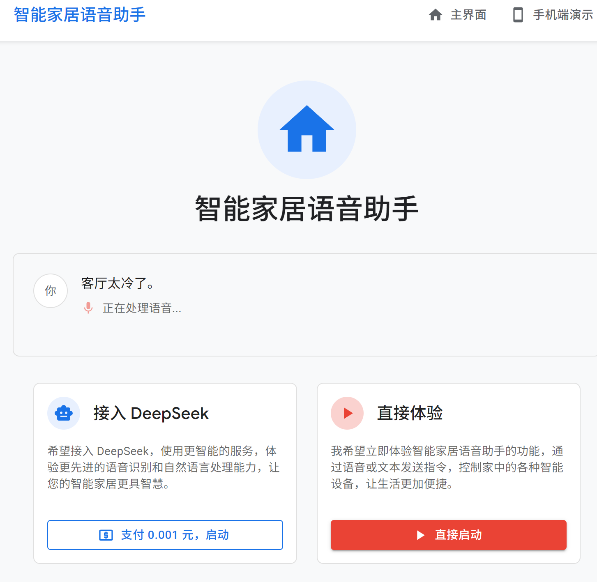

# UPDATELOG

* 实时分工调整在`docs/member_summary.md`下记录
* 可以把整个项目克隆下来，然后`run.bat`试试效果。

## 5.24 (Version 0)
* 完善了nlp_service的README文档，添加了简单可用的测试界面
* 使用zhconv解决whisper会识别成繁体中文的问题，把繁体中文转换成简体中文。
* 添加、修改了前后端目前框架的README

## 5.20 (Version 0)

* Apple-Style


## 5.18 （Version 0）
* 写文档、画图的同学可以根据这些实时进度来理解代码结构：
* 其中更详细的软件设计讲解在`docs/design.md`

#### 数据流
```
[前端]
   |
   | 语音/文本输入
   v
[Spring Boot 后端 Controller]
   |
   | 通过 HTTP 调用
   v
[nlp_service FastAPI 服务]
   |
   | 返回结构化结果（transcribed_text, nlu_result, tts_output_reference, ...）
   v
[Spring Boot 后端 Service]
   |
   | 设备控制/业务逻辑
   v
[前端]
   |
   | 显示结果/反馈
   v
[用户]
```

* 目前已完成的：
### 便于理解的版本
* **如果想尝试当前效果，按照readme里的说明，然后run.bat，就可以文本输入，或者说话，就可以看见对你的语音或文字的理解效果，nlp_service的命令窗口有更详细的调试信息**。


* 有一个还不错的前端界面，包括网页，和“手机端”，能调节设置
* 后端只有框架，设备的绑定、能被用户调整正在施工。
* 语音服务：目前能实现“客厅太冷了”或者“客厅空调调高2度”都被返回`{空调、0、客厅、modify、2}`给后端的效果，以供后端施加效果到设备上。
* 用户想文字输入还是语音输入都可以
* 用户想不想要语音反馈都可以
* 暂不支持dolphin引擎的语音转文本，因为需要安装espnet=202402，但这个要求的`importlib-metadata<5.0`，会与`opentelemetry-api 1.33.1`的`importlib-metadata>=6.0,<7.0`冲突。

* 会返回语音反馈音频文件，但还没有实现音频的播放

### 尝试TO DO：
* 用docker部署试试
* 云服务器
* 部署到一个.io网站上

### 从更深层次解释
#### NLP服务
* **STT**（speech_to_text）：能接受语音输入，使用whisper引擎进行 **语音转文本** 的功能，**还不错，后续考虑指定转录语言，或者用opencc库将识别结果转成简体中文**，需要添加一些音频文件来测试
* 暂时打算：
  - 建议中文用户用dolphin引擎（考虑到更多的中文方言支持）（环境依赖冲突，不打算支持了）
  - 建议用户用whisper引擎
* **NLU**（natural_language_understanding）：能**接受文本输入**，然后用一个被100多条**家居场景数据**微调过后的中文BERT模型进行意图识别，然后返回**识别出来的五个字段**（家居类型，家居编号（用户说的，比如客厅里的第2个灯的"2"），地点，动作，动作参数）
  - **用户可选**：用户认为自己说的话比较标准，能说出“客厅空调调高2度”这种，就用用fine-tuned-bert-processor就好
  - 用户想更智能，用nlu_orchestrator。
* **5.18新增**：
  - 为了能实现“我太冷了”这样不带任何动作、家居的语句都被映射成实际操作的效果，加入**RAG知识库检索**，RAG知识库见`nlp_service/nlu/model/dataset/rag_knowledge.jsonl`，**正在构建中**（要比微调数据集更规范一点）。
  - 实现逻辑是，如果直接用**微调BERT+后处理**仍然未能提取用户的任何**动作**或者任何**家居类型**（只要少一个，就认为没有理解到），就去RAG知识库检索，这个时候，“我太冷了”会检索出和它最像的语句“空调调高2度”
  - 用来微调的数据集（在`nlp_service/nlu/model/dataset/`）还行，可以改后几十条；微调模型的代码在`nlp_service/nlu/model/train/`目录下
  - 这个微调好的模型参数（放在`nlp_service/nlu/model/fine_tuned_nlu_bert/`目录下）由于有几百MB，**放在hugging face上LIUWJ/fine-tuned-home-bert**，这样用户第一次使用时就能从hugging face上下载这个模型，代码里写好了这部分的下载逻辑。

* **TTS**（text_to_speech）：能接受文本输入，返回语音（女声男声可选），用pyttsx3。
* 除了NLU模块是必要的，STT和TTS模块都是可选的，**用户可以选择不使用这两个模块（直接文本输入，不需要语音转文本的STT模块；不需要语音播报反馈，就不需要TTS模块）**

#### 前端
* 目前有一个大的网页界面，网页界面里可以看到手机端视图


* 但是，手机端只有这1个界面，还缺乏：
  - 手机端的设置界面
  - 适合老年人的大字设计界面
  - ...
* 大的网页界面也只有一些基本的组件，还需要后续设计与完善
* 目前的代码组织如下，需要**前端的同学继续完善**：
  - 主要在frontend/src下，完善各种网页组件、网页视图
```
frontend/
├── node_modules/      # 第三方依赖库，自动生成
├── public/            # 静态资源
│   ├── index.html     # 应用入口 HTML
│   └── manifest.json  # PWA 配置
├── src/               # 应用源代码
│   ├── components/    # 可复用 UI 组件
│   │   ├── Layout.js        # 整体布局
│   │   └── VoiceInput.js    # 语音输入核心
│   ├── pages/         # 页面级组件
│   │   ├── Home.js          # 主页
│   │   ├── PhoneView.js     # 手机视图/控制
│   │   ├── Settings.js      # 设置页
│   │   ├── Weather.js       # 天气页
│   │   └── 还需要手机设置页，手机天气页...等
│   ├── services/      # API 调用与服务
│   │   └── api.js         # 后端接口封装
│   ├── App.js           # 根组件 (路由、全局配置)
│   ├── index.css        # 全局样式
│   ├── index.js         # React 应用入口
│   └── MobileApp.css    # 移动端特定样式
├── package-lock.json  # 依赖版本锁定
├── package.json       # 项目配置与依赖
└── README.md          # 项目说明
```
## 5.19 (Version 0.1)
* 使用AI重构了一个更好看的前端
* 能保证设置的修改被保存，并及时更改后台 语音服务处理的引擎。




#### 后端
* 主要实现`backend/src`下的代码（详细结构看下面），`backend/target`是自动生成的。
* Spring Boot 后端做“转发+业务编排”，语音/文本理解、TTS 可以交给 nlp_service 负责。spring boot后端也可以加上自己的STT,TTS业务。
* Spring Boot 后端需要**实现一个“设备控制”的逻辑，这个逻辑需要根据nlp_service返回的结构化数据进行业务处理。还需接入数据库**。
* 当前：
1. NlpServiceClient.java
   - 只负责和 Python 的 nlp_service 服务（FastAPI）进行 HTTP 通信。
   - 发送音频或文本到 /process_audio、/process_text。
   - 解析并返回原始 JSON 结果（如 nlu_result、transcribed_text、tts_output_reference 等）。
   - 本质：是一个“远程服务客户端/适配器”，不做业务逻辑，只做“请求-响应”转发。
2. SmartHomeCommandOrchestrator.java
   - 负责“业务编排”，即把前端的请求（音频/文本）转发给 NlpServiceClient，拿到结果后，结合设备服务做进一步处理。
   - 调用 NlpServiceClient 获取 NLP 结果。
   - 解析 nlu_result，调用 DeviceService 控制设备。
   - 组装最终要返回给前端的结构（如 deviceActionFeedback、tts_output_reference 等）。
```
Controller
   ↓
SmartHomeCommandOrchestrator
   ↓
NlpServiceClient  <——>  nlp_service (Python)
   ↓
DeviceService
```
3. Controller 层
   - 语音/文本接口只需负责接收前端请求，调用 Orchestrator，返回结构化响应即可。
4. 数据结构
   - 和nlp_service保持一致。

* 代码结构：
```
main/
├── java/com/smarthome/assistant/
│   ├── controller/                        # 控制器层，REST接口入口
│   │   ├── DeviceController.java              # 设备相关接口
│   │   ├── SettingsController.java            # 语音/系统设置接口
│   │   ├── VoiceCommandController.java        # 语音命令（文本）接口
│   │   └── VoiceController.java               # 语音相关接口（如语音命令、转文本）
│   ├── dto/                              # 数据传输对象（前后端/服务间结构）
│   │   ├── ApiResponse.java                  # 通用API响应封装
│   │   ├── FrontendResponseDto.java          # 返回前端的统一响应
│   │   ├── NluResultDisplayDto.java          # NLU结果展示结构
│   │   ├── TextCommandRequestDto.java        # 文本命令请求结构
│   │   └── VoiceResponse.java                # 语音命令响应结构
│   ├── entity/                           # 实体类
│   │   └── Result.java                        # 通用结果实体
│   ├── exception/                        # 全局异常处理
│   │   └── GlobalExceptionHandler.java        # 全局异常处理
│   ├── model/                            # 业务数据模型
│   │   ├── Device.java                        # 设备数据模型
│   │   └── VoiceCommand.java                  # 语音命令数据模型
│   ├── repository/                         # JPA数据库操作接口
│   │   └── DeviceRepository.java              # 设备数据库操作
│   ├── service/                          # 业务逻辑层
│   │   ├── DeviceService.java                 # 设备服务接口
│   │   ├── DeviceServiceImpl.java             # 设备服务实现（连接MySQL）
│   │   ├── NlpServiceClient.java              # NLP服务HTTP客户端
│   │   ├── SmartHomeCommandOrchestrator.java  # 核心业务编排

│   ├── config/                            # 配置相关
│   │   └── AppConfig.java                      # Spring Boot 配置类
│   ├── util/                              # 工具类
│   │   └── GetFileContentAsBase64.java         # 文件转Base64等工具
│   └── SmartHomeApplication.java           # Spring Boot 应用入口
├── resources/
│   └── application.yml                     # Spring Boot 配置文件，以及mysql配置
```


---

## 5.14-5.16 
* 重新梳理了语音服务逻辑，修改为nlp_service模块，tts与stt都应是可选的 
目前的效果：


能成功保存设置了：

进一步确认了前后端的服务调用、连接，确保能调用提供的nlp_service：


微调了一个BERT-chinese，然后用微调好的模型实现了基本的NLU：


---

## 5.13
把后端重构成了spring-boot框架，实现正常的前后端连接，有了一个手机端视图，更好看了一点。


* 点击 移动视图，可以看到暂时的APP结果：


---
## 5.12
* 实现了基本的前后端连接、语音输入 


```


