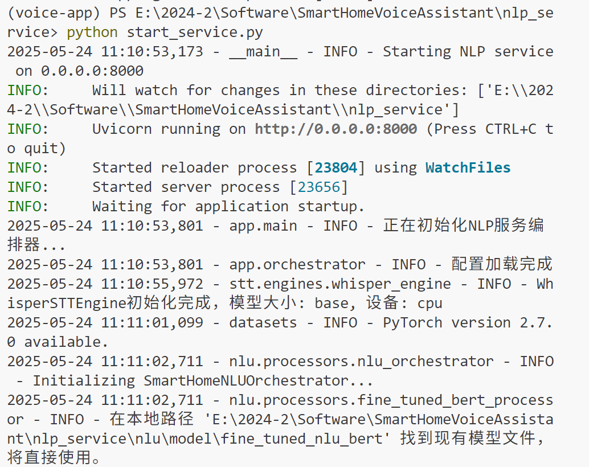
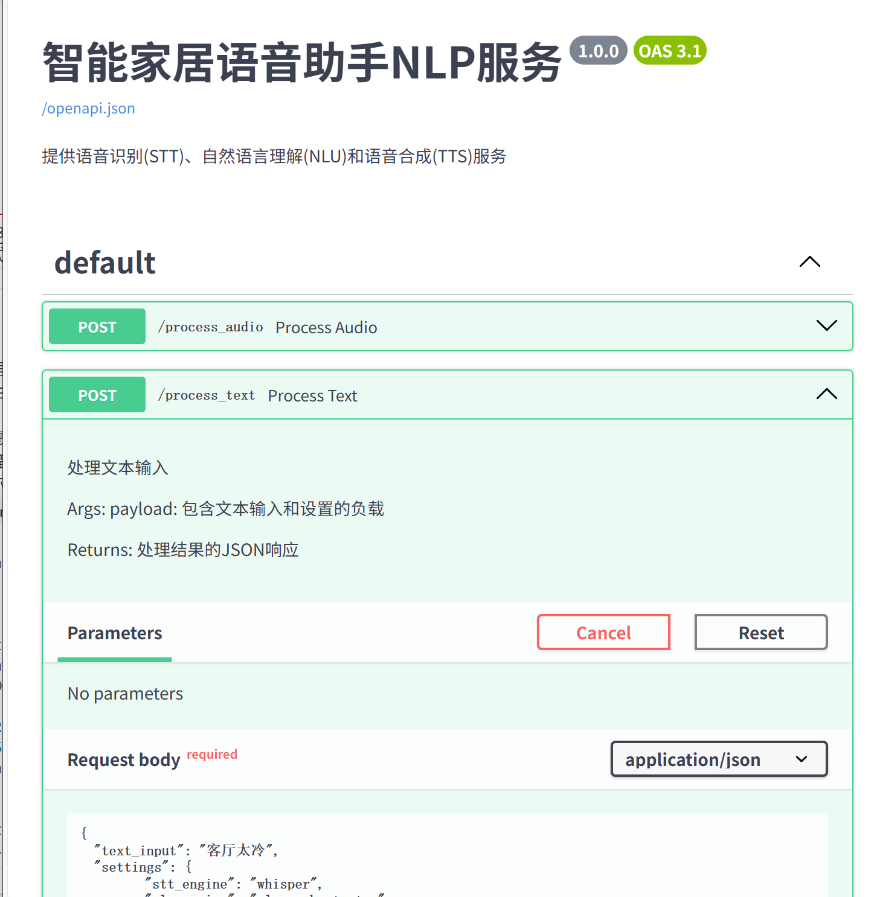
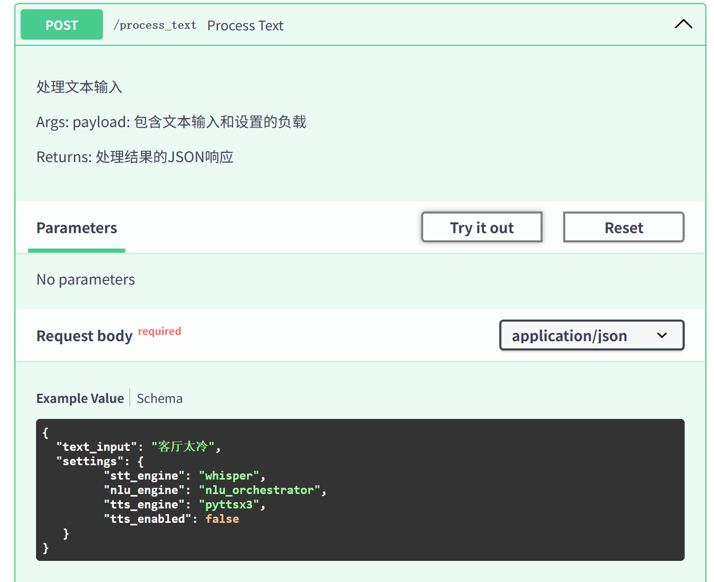
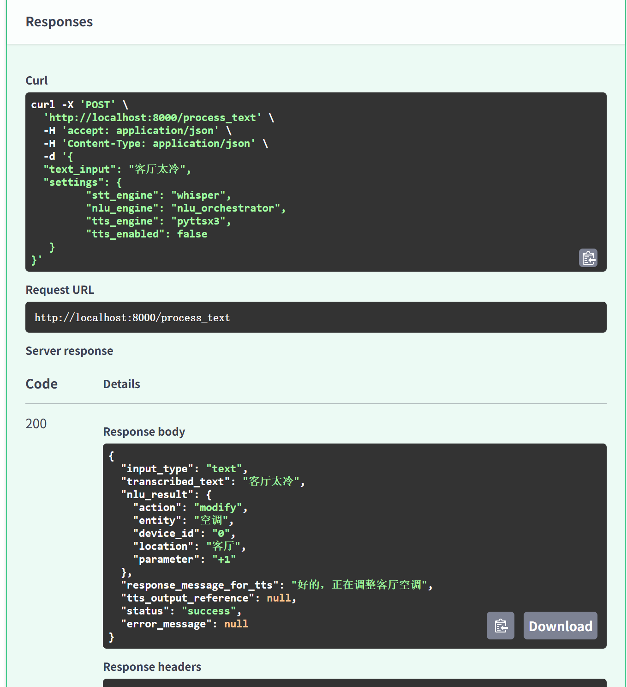

# NLP服务接口文档

## 0. 最直接的测试手段：
```
cd nlp_service
python start_service.py
```
然后，可以看到如下启动信息：



* 方法1：直接在文件管理器里双击打开nlp_test.html
* 方法2，如下：
* 打开:http://localhost:8010/docs
* 这是fastAPI自动生成的API交互式文档，可以看到如下界面：


* 然后下拉，找到`Try it Out`按钮，就可以直接测试了：


* 输入的setting有2种：
```bash
{
  "text_input": "客厅太冷",
  "settings": {
         "stt_engine": "dolphin",
         "nlu_engine": "nlu_orchestrator",
         "tts_engine": "pyttsx3",
         "tts_enabled": true
   }
}
```
或者
```bash
{
  "text_input": "客厅太冷",
  "settings": {
         "stt_engine": "whisper",
         "nlu_engine": "fine_tuned_bert",
         "tts_engine": "pyttsx3",
         "tts_enabled": false
   }
}
```

* 响应结果如下（后续把端口改成了8010）:



## 1. 服务架构

NLP（自然语言处理）服务是智能家居语音助手的核心组件，负责将用户的自然语言指令转化为系统可理解和执行的结构化命令。本服务由以下核心模块组成：

- **NLU模块**: 自然语言理解，负责意图识别、实体抽取和语义解析
- **STT模块**: 语音转文本，将语音输入转换为文本
- **TTS模块**: 文本转语音，将响应文本转换为语音输出

### 1.1 目录结构

```
nlp_service/
├── app/              # 核心应用逻辑
│   ├── main.py       # FastAPI应用入口点
│   ├── orchestrator.py  # 服务编排器
│   └── __init__.py
├── config/           # 配置文件
├── data/             # 训练数据和模型
├── interfaces/       # API接口定义
│   ├── nlu_interface.py  # NLU接口
│   ├── stt_interface.py  # STT接口
│   ├── tts_interface.py  # TTS接口
│   └── __init__.py
├── nlu/              # 自然语言理解模块
├── stt/              # 语音转文本模块
├── tts/              # 文本转语音模块
├── start_service.py  # 服务启动脚本
└── __init__.py       # 包初始化文件
```

### 1.2 系统调用流程

实际系统调用流程如下：

```
前端 → Spring后端 → Python NLP服务 → Spring后端处理结果 → 前端展示执行动作
```

## 2. 接口规格

### 2.1 核心API接口

#### 2.1.1 音频处理接口

- **接口名称**：处理音频输入
- **接口URL**：`http://localhost:8010/process_audio`
- **端口**：8010
- **请求方式**：POST (multipart/form-data)
- **响应格式**：JSON

#### 2.1.2 文本处理接口

- **接口名称**：处理文本输入
- **接口URL**：`http://localhost:8010/process_text`
- **请求方式**：POST
- **数据格式**：JSON
- **响应格式**：JSON

#### 2.1.3 健康检查接口

- **接口名称**：健康检查
- **接口URL**：`http://localhost:8010/health`
- **请求方式**：GET
- **响应格式**：JSON

### 2.2 调用位置

本服务在系统中的实际调用位置：

| 调用方 | 被调用API | 功能描述 |
|---------|---------|----------|
| Spring后端 | `/process_audio` | 处理用户语音输入 |
| Spring后端 | `/process_text` | 处理用户文本输入 |
| Spring后端 | `/health` | 检查服务是否正常运行 |

后端调用链路：

1. 前端语音命令: `frontend/src/hooks/useVoiceCommand.js → voiceApi.sendVoiceCommand`
2. 前端文本命令: `frontend/src/hooks/useTextCommand.js → voiceApi.sendTextCommand`
3. 后端控制器: `backend/.../controller/VoiceCommandController.java → processAudioCommand/processTextCommand`
4. 后端服务: `backend/.../service/SmartHomeCommandOrchestrator.java → orchestrateAudioCommand/orchestrateTextCommand`
5. NLP客户端: `backend/.../service/NlpServiceClient.java → callProcessAudio/callProcessText`
6. NLP服务: `nlp_service/app/main.py → process_audio/process_text`

### 2.3 完整调用流程

1. **用户输入流程**:
```
用户输入(语音/文本) → 前端处理 → Spring后端API → NLP服务 → 语义理解 → 设备状态变更 → 前端展示
```

2. **具体处理链路**:
```
前端组件 → 前端API服务(api.js) → Spring后端控制器 → NLP服务客户端 → Python NLP服务 → 结果处理 → 设备状态更新 → 前端UI更新
```

## 3. 音频处理接口

### 3.1 请求参数

#### 请求头
```
Content-Type: multipart/form-data
```

#### 表单参数

| 参数名 | 类型 | 必填 | 说明 |
|-------|------|-----|------|
| audio_file | File | 是 | 上传的音频文件 |
| settings_json | String | 是 | JSON字符串形式的设置 |

#### 设置参数示例
```json
{
  "stt_engine": "placeholder",
  "nlu_engine": "placeholder",
  "tts_engine": "placeholder",
  "tts_enabled": true
}
```

### 3.2 响应参数

| 参数名 | 类型 | 说明 |
|-------|------|------|
| input_type | String | 输入类型，固定为"audio" |
| transcribed_text | String | STT转换的文本结果 |
| nlu_result | Object | NLU处理结果(五元组) |
| response_message_for_tts | String | 回复消息文本 |
| tts_output_reference | String | TTS音频引用(可选) |
| status | String | 处理状态，"success"或"error" |
| error_message | String | 错误信息(仅当status为"error"时) |

#### nlu_result字段格式
```json
{
  "action": "turn_on",
  "entity": "light",
  "device_id": "1",
  "location": "bedroom",
  "parameter": null
}
```

**说明**：nlu_result是从内部五元组格式转化而来的，内部五元组使用大写键名，而API响应使用小写键名。五元组的内部表示为：

```json
{
  "ACTION": "turn_on",
  "DEVICE_TYPE": "light",
  "DEVICE_ID": "1",
  "LOCATION": "bedroom",
  "PARAMETER": null
}
```
#### 响应示例

```json
{
  "input_type": "audio",
  "transcribed_text": "打开卧室的灯",
  "nlu_result": {
    "action": "turn_on",
    "entity": "light",
    "device_id": "1",
    "location": "bedroom",
    "parameter": null
  },
  "response_message_for_tts": "好的，正在打开卧室灯",
  "tts_output_reference": "base64://...",
  "status": "success",
  "error_message": null
}
```

## 4. 文本处理接口

### 4.1 请求参数

#### 请求头
```
Content-Type: application/json
```

#### 请求体

| 参数名 | 类型 | 必填 | 说明 |
|-------|------|-----|------|
| text_input | String | 是 | 文本输入 |
| settings | Object | 否 | 设置对象 |

#### 请求示例
```json
{
  "text_input": "打开卧室的灯",
  "settings": {
    "nlu_engine": "placeholder",
    "tts_engine": "placeholder",
    "tts_enabled": true
  }
}
```

### 4.2 响应参数

与音频处理接口的响应格式相同，但`input_type`值为"text"。

#### 响应示例
```json
{
  "input_type": "text",
  "transcribed_text": "打开卧室的灯",
  "nlu_result": {
    "action": "turn_on",
    "entity": "light",
    "device_id": "1",
    "location": "bedroom",
    "parameter": null
  },
  "response_message_for_tts": "好的，正在打开卧室灯",
  "tts_output_reference": "base64://...",
  "status": "success",
  "error_message": null
}
```

## 5. 健康检查接口

### 5.1 请求参数

无参数

### 5.2 响应参数

| 参数名 | 类型 | 说明 |
|-------|------|------|
| status | String | 服务状态，"healthy"表示正常 |
| service | String | 服务名称，固定为"nlp_service" |
| version | String | 服务版本号 |

#### 响应示例
```json
{
  "status": "healthy",
  "service": "nlp_service",
  "version": "1.0.0"
}
```
